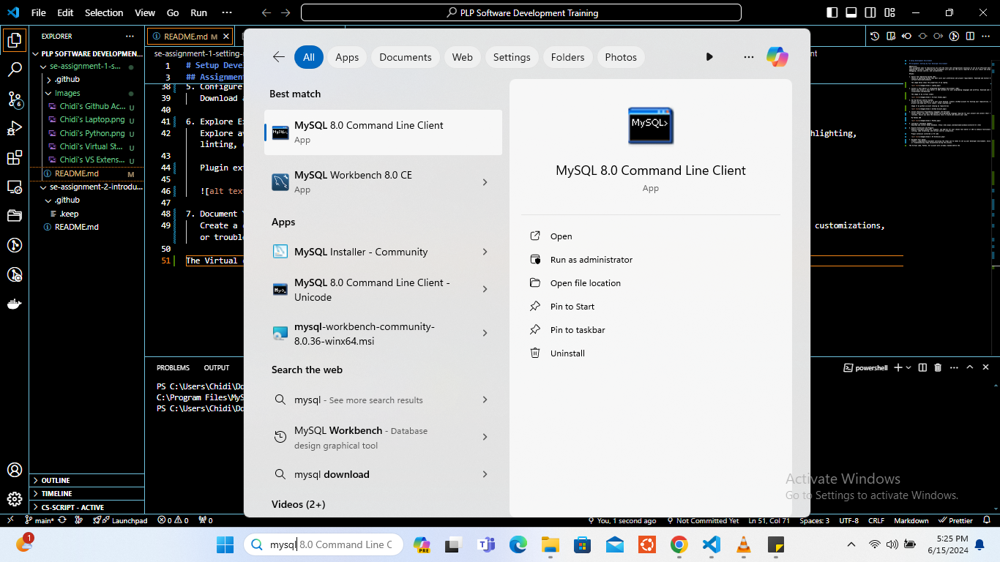

# Setup Development Environment

## Assignment: Setting Up Your Developer Environment

## Objective:

This assignment aims to familiarize you with the tools and configurations necessary to set up an efficient developer environment for software engineering projects. Completing this assignment will give you the skills required to set up a robust and productive workspace conducive to coding, debugging, version control, and collaboration.

## Tasks:

1. ### Select Your Operating System (OS):

   Choose an operating system that best suits your preferences and project requirements. Download and Install Windows 11. https://www.microsoft.com/software-download/windows11

   The image below shows the properties of my laptop.

   

2. ### Install a Text Editor or Integrated Development Environment (IDE):

   Select and install a text editor or IDE suitable for your programming languages and workflow. Download and Install Visual Studio Code. https://code.visualstudio.com/Download

   The image of my virtual studio

   

3. ### Set Up Version Control System:

   Install Git and configure it on your local machine. Create a GitHub account for hosting your repositories. Initialize a Git repository for your project and make your first commit. https://github.com

   Image of my github acccount showing my repositories

   

4. ### Install Necessary Programming Languages and Runtimes:

   Instal Python from http://wwww.python.org programming language required for your project and install their respective compilers, interpreters, or runtimes. Ensure you have the necessary tools to build and execute your code.

   My Python IDE

   

5. ### Configure a Database (MySQL):

   Download and install MySQL database. https://dev.mysql.com/downloads/windows/installer/5.7.html

   

6. ### Explore Extensions and Plugins:

   Explore available extensions, plugins, and add-ons for your chosen text editor or IDE to enhance functionality, such as syntax highlighting, linting, code formatting, and version control integration.

   Plugin extension installed in VS code

   

7. ### Document Your Setup:
   Create a comprehensive document outlining the steps you've taken to set up your developer environment. Include any configurations, customizations, or troubleshooting steps encountered during the process.

The Virtual code, Python, Git account were already created before the before the beginning of the class. The only software I had to install was MySQL. The installation went smoothly with the help of [the documentation](https://phoenixnap.com/kb/install-mysql-on-windows). The only issue I encountered was that the MySQL Workbench did not come with MySQL software, I had to download it from [HERE](https://dev.mysql.com/downloads/workbench/) and install it different, after that, the whole setups were complete.

For further studies on MySQL, check W3Schools tutorials on [SQL](https://www.w3schools.com/sql/default.asp) and [MySQL](https://www.w3schools.com/mysql/default.asp)
